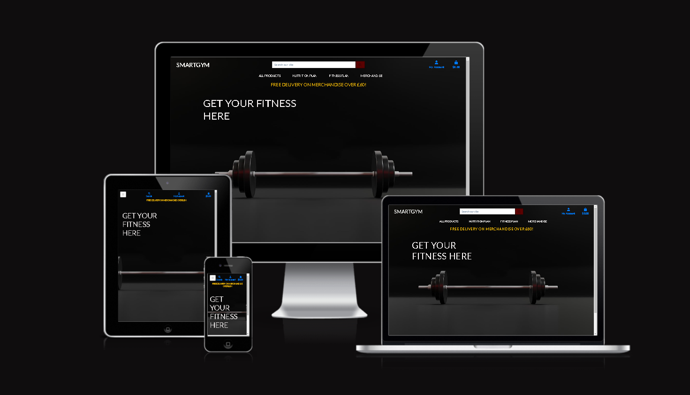
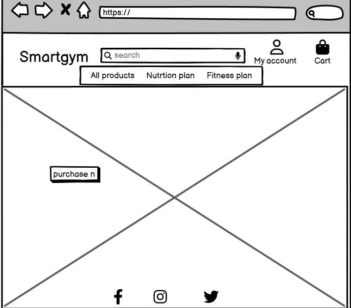
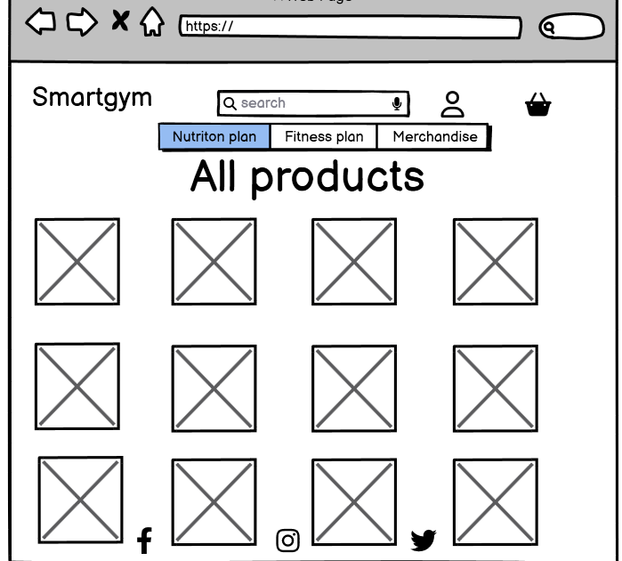

#                                        **CI-MS4-Smartgym** - Code Institute Milestone Project 4, Full Stack Module

#                                      
A live website can be found [here](https://8000-jamesrcutmore-smartgym-07qqybfxuj7.ws-eu104.gitpod.io)

## **Table of Contents**

 * [About](#about)
  * [User Experience](#User-experience)
  * [Project Goals](#project-goals)
  * [Target Audience](#target-audience)
  * [User Stories](#user-stories)
  * [Design](#design)
  * [Wireframe](#wireframe-views)
  * [Features](#features)
  * [Existing Features](#existing-features)
  * [Features Left to Implement](#features-left-to-implement)
  * [Technologies-Used](#technologies-used)
  * [Testing](#testing)
  * [Deployment](#deployment)
  * [Credits](#credits)
  * [Content](#content)
  * [Media](#media)
  * [Acknowledgements](#acknowledgements)

---
# User Experience
## User Stories

### As an unregistered, I want to :

+ to be able to browse through all products available.
+ have the ability to use the search function.
+ have the ability browse through the gym and nutrition plans available.
+ have generic questions answered without having to contact the store owner/admin.
+ be able to view my bag and any items I currently have awaiting payment in my bag.
+ be able to add, edit quantity and remove items from my bag.
+ be able to purchase from the site without having to register for an account.
+ have the ability to register to the site if I choose to.

### As a registered user, I want to:

+ have the ability to log in to the site with  my details.
+ have a record of any purchases that I have made in the past and view them in detail.
+ be able to update my shipping information.
+ be able to update my shipping information from the checkout page. 
+ be able to view the class videos offered.

### As the site administrator, I want to:

+ be able to log in to an admin panel.
+ be able to add, update or remove products, gym , nutrition plans and merchandise without vistiting the admin panel.
+ receive email notifications when a user submits through the contact page.

### **Project Goals**

- The project goals are to create a website that people can browse through gym and fitness plans and buy branded smartgym merchandise.

### **Target Audience**

- The target audience are anyone who interested in healthy lifestyle and diet.

 
# **Design**

+ **Colour Scheme** 

- I wanted to keep it colorful and fun!
  
- Bright  primary colours so to make it easy and fun to navigate.

  
+ **Typography**

  The main font throughout the quiz is Josefin Sans with a back up font of sans-serif.Here we used google fonts.
  [Google Fonts](https://fonts.google.com/)

+ **Imagery**
 
  The imagery for the quiz game is simple colouful and pleasing on the eye. The navigation buttons are bright primary 
  colour's with 3D effect movement with the hover over.
  
- [Pixabay](https://pixabay.com/)

- [google images](https://www.google.com/imghp?hl=en/)

- [Getti images](https://www.gettyimages.co.uk/)

   ---
 # **Sitemap**

- The site is easy to navigate functional and responsive

   
 # **Wireframe views**

---

# **Wireframe Tablet view**

---

# **Wireframe Mobile view**

---
---

### **Features**

# **Existing Features**

- Homepage which entails a recipe page a login page which takes you to your recipes to edit etc and a sign up/in page which 
  allows you to register. 

- You can press the home page link at any time fron any page.

- You can login and edit and also add new recipes.

- You can register from the login page or go straight to sign up.

- social media links on footer.

**_Recipes avaliable to all users_**

All recipes are avaliable to all users, so that all users will get to taste what the website is all about, and what they can experience, then decide if they would like to explore more functionalities of the website.

**_Users can search recipes based on either key words or ingredients_**

For smoothies, most people may not familiar with a specific name. The main ingredient or the main liquid is what people look at when it comes to searching. This feature will meet this particular user need.

**_Users can view full recipe_**

Users can access the full recipe page and view the ingredients and method, smoothie category and the username of the recipe creator.

**_Users account management_**

- **Register** Users have the option to create an account.

- **LogIn** registered users can access their account by logging in.

- **LogOut** Once the user finished using the site, they have a option of logging out the website.

- **Dashboard** for users to add there recipes.

**_Users Recipes management_**

A registered user will be able to upload their own recipes to the site. All access is shown on my recipes page.

- rob_cutmore@hotmail.com- password- Hutton.. can be used to edit the kiwi smoothie after the link fo kiwi smoothie is clicked. other smoothie links are for other users, and only they can edit.

- Upload: users will be asked to fill up a form to upload a recipe. The form is validated. It means that the user cannot leave any inputs blank and white spaces.( Ingriedients and method are comm seperated )

- Edit: the user can edit their own recipes on my recipes page by hover over the recipe image and click on edit button. They will be shown the form their filled out when they created the recipe, they can make changes and save.( Ingriedients and method are comm seperated ) .

- Delete: the user can delete their own recipes by clicking on the delete button when hovering over the recipe image. A confirmation message modal will pop up to confirm deletion.

# **Features Left to Implement**
+ To have more individual recipes catogories.
+ To have a better colour scheme.
+ To be able to search individual ingriedients.
+ Calorie count would have been a great feature.
+ To have added more content in general.
---

# Technologies Used
## Languages
+ [HTML5](https://en.wikipedia.org/wiki/HTML5)
+ [CSS3](https://en.wikipedia.org/wiki/CSS)
+ [JavaScript](https://en.wikipedia.org/wiki/JavaScript)
+ [Python3](https://www.python.org/)

## Frameworks and Libraries
+ [Django](https://www.djangoproject.com/)
+ [Pip3](https://pip.pypa.io/en/stable/)
+ [jQuery](https://jquery.com/)
+ [FontAwesome](https://fontawesome.com/)
+ [Google Fonts](https://fonts.google.com/)
+ [Bootstrap](https://getbootstrap.com/)

## All Others
+ [Heroku](https://www.heroku.com/) used to deploy live site.
+ [Stripe](https://stripe.com/en-ie) used for the payments system.
+ [GitHub](https://github.com/) used to host repository.
+ [GitPod](https://www.gitpod.io/) used to develop project and organise version control.
+ [Canva](https://www.canva.com/) used for the inital design. 
+ [Balsamiq](https://balsamiq.com/) used to create wireframes.
+ [RandomKeygen](https://randomkeygen.com/) used to create a strong password for required  `<SECRET_KEY>`.
+ [Transfonter](https://transfonter.org/) used to convert font from .tff to .woff and .woff2.
+ [Lighthouse](https://developers.google.com/web/tools/lighthouse) for performance review.
+ [Responsinator](https://www.responsinator.com/) used to check site was responsive on different screen sizes.
+ [Am I Responsive](http://ami.responsivedesign.is/) used to generate README intro image.
+ [favicon.io](https://favicon.io/) used to create a site favicon.
+ [Elephant SQL](https://www.elephantsql.com/) used for database.
---

   

# **Testing**

## Manually Testing Functionality
### Navigation Buttons
+ Tested each page individually and clicked each button to make sure that they navigate to the correct place.
+ Tested each page individually on desktop and hovered over each button to make sure that Hover over is applied .
+ Tested each page individually on mobile and made sure hover over isn't applied.
### Home Button
+ Smartgym  buttton tested and working correctley.
### Recipe button
+ Purchase now button tested and worked as expected. 
### All products Button
+ Login button also price ,rating and catogory tested and works correctly 
### Nutrition plan Button
+ nutrition plan also all options inside, button works as exspected. 
### Gym plan button
+ Gym plan and all inside performs as exspected. 
### Merchandise Button
+ Mrechandise button and all inside works correcley.
### Search our site option
+ search our site option works correcley. 
### My account button
+ My account button with login and register works correcley.
### Bag button
+ bag button with update remove and subtotal works correcley. 
### Checkout button
+ check button works correcley. 
### Complete order button
+ complete order button  works correcley. 
 
### Social media links 
+ All social media links work as exspected. 

### Log out
+ Log in button works as exspected.

| Feature | Expected Outcome | Testing Performed |  Actual Result | Outcome |
| --- | --- | --- | --- | --- |
| The Smartgym title | Link directs the user back to the home page | Clicked title |  page reloads | Pass |
|  Recipe nav link | Clicked on button | Takes you to the recipes | Pass |
|Login button  | Clicked on  button | Login opens | Pass |
|Sign up button |  | Clicked button | sign up form opens | Pass |
|Register button | Takes you to sign up/ register form | Clicked on button | Form opens | Pass |
|Edit Recipe | edit form opens | works correctley | Pass |
|Home button |clicked on button | Clicked on button | redirects to home from other pages | Pass |
| Sign up (submit button) | clicked button |works correctley  | Pass |
|Facebook link in footer  | Clicked on button | Takes you to face book| Pass |
|Twitter link in footer  | Clicked on button | Takes you to Twitter| Pass |
|Instagram link in footer  | Clicked on button | Takes you to Instagram| Pass |
| All buttons - hover effect | All buttons have hovered over with movement. | Hover over each button on the page |button movenment correctly performing  when hovered over | Pass |
|  Cursor pointer| cursor displayed when moved over buttons | mouse positioned over each button to check the cursor changed  | cursor changed when hoverd | Pass |

---
# Automatic testing

### Validation
 - W3C Validation was used:
 - HTML
 - CSS
 - pip8 was used for python.
 - JS Hint was used to validate javascript.

 #  Links to above mentioned are in languages used.

# Known bugs

 + Initially when you where logged in , it would stay show as logged in , in the nav bar.
---
+ Solved bug, (typo in code, found in app.py)

# Lighthouse performance

+ ## Desktop Home screen
 
+ # Desktop Recipes 
 
+ # Desktop Login
 
 + # Desktop Dashboard
 
 + # Desktop Sign up
 
 + # Desktop Edit page
 
+ # Mobile view Home screen
 
+ # Mobile view Recipes  Page
 
+ # Mobile view login page
 
+ # Mobile view Dashboard  page
 
+ # Mobile view Sign up page
 
+ # Mobile view Edit page
 

 ## Deployment & Local Development

 ## **Deployment**

### **Heroku Deployment**

I deployed this project to heroku using the following steps:

#### **Deployment**

- Log into Heruko
- Under dashboard, Select "Create New App"
- Choose an app name (it shows in red if the name is already taken)
- select a region base on your location
- click "Create app"

### Deploying to Github Pages

* Choose the repository you want to deploy from the main overview.
* Go to settings by clicking on the icon on the menu.
* In the left navigation, select the "Pages" option.
* Under "Source", choose "Master" branch and click "Save".
* After it's done, you will see a message saying "Your site is ready to be published at (insert url here)".

### Local Development
#### How To Fork

Forking a repository is the process of creating a copy of the original repository. This enables you to make changes without affecting the main repository. 

To do so:-
* go to the GitHub repository you want to copy.
* select the 'Fork' button located in the top right corner, under your profile icon. 
* Once complete, you will now have your own version of the repository to make changes to.

#### How To Clone

To copy a GitHub repository:-
* first navigate to the repository you wish to copy. 
* click on the 'Code' button (which has a download icon) and copy the link provided.
* in the Gitpod Terminal, navigate to the directory where you wish to place the clone. Then, type 'git clone' and paste the link you copied earlier and press enter. This process can also be completed using VSCode.

# **Credits**

### **Content**

Throughout the process of doing this project I have done a lot from searching and investigating. All resources are referenced in the credits and the codes in the section below. 

 # Codes

   [w3schools](https://www.w3schools.com/) - [audio](https://www.w3schools.com/html/html5_audio.asp), [javascript modal](https://www.w3schools.com/howto/howto_css_modals.asp), [loader](https://www.w3schools.com/howto/howto_css_loader.asp), [cubic-bezier](https://www.w3schools.com/cssref/func_cubic-bezier.asp), [javascript objects](https://www.w3schools.com/js/js_objects.asp), [setInterval and clearInterval](https://www.w3schools.com/jsref/met_win_setinterval.asp), [setTimeout](https://www.w3schools.com/js/js_timing.asp), [Array splice](https://www.w3schools.com/jsref/jsref_splice.asp), [DOM changing CSS](https://www.w3schools.com/js/js_htmldom_css.asp), [JSON.parse()](https://www.w3schools.com/js/js_json_parse.asp), [Math.floor()](https://www.w3schools.com/jsref/jsref_floor.asp), [CSS background-image](https://www.w3schools.com/cssref/pr_background-image.asp), [CSS box-shadow](https://www.w3schools.com/cssref/css3_pr_box-shadow.asp), [Array map()](https://www.w3schools.com/jsref/jsref_map.asp)

   [stackoverflow](https://stackoverflow.com/) - [display options randomly](https://stackoverflow.com/questions/53362187/javascript-quiz-display-random-options), [difference between innerText and innerHTML](https://stackoverflow.com/questions/19030742/difference-between-innertext-innerhtml-and-value), [convert an object key value into an array](https://stackoverflow.com/questions/38824349/how-to-convert-an-object-to-an-array-of-key-value-pairs-in-javascript)

   [MDN Web Docs](https://developer.mozilla.org/en-US/docs/Web/JavaScript/Reference/Global_Objects/Math/max) - [Math.max()](https://developer.mozilla.org/en-US/docs/Web/JavaScript/Reference/Global_Objects/Math/max), [window.location.assign()](https://developer.mozilla.org/en-US/docs/Web/API/Location/assign), [window.localStorage](https://developer.mozilla.org/en-US/docs/Web/API/Window/localStorage), [Array.prototype.join()](https://developer.mozilla.org/en-US/docs/Web/JavaScript/Reference/Global_Objects/Array/join), [Element.classList](https://developer.mozilla.org/en-US/docs/Web/API/Element/classList), [parseInt()](https://developer.mozilla.org/en-US/docs/Web/JavaScript/Reference/Global_Objects/parseInt), [Spread syntax](https://developer.mozilla.org/en-US/docs/Web/JavaScript/Reference/Operators/Spread_syntax), [forEach](https://developer.mozilla.org/en-US/docs/Web/JavaScript/Reference/Global_Objects/Array/forEach), [Fetch API](https://developer.mozilla.org/en-US/docs/Web/API/Fetch_API)

   [7 Methods for Comparing Arrays in JavaScript](https://javascript.plainenglish.io/7-methods-for-comparing-arrays-in-javascript-88f10c071897)

   [How To find your Target audience..Adam Erhart..](https://youtu.be/FzEkHlYt2uA/)

   [How to write a good user story](https://stormotion.io/blog/how-to-write-a-good-user-story-with-examples-templates/#.YFM57o-2eQY.linkedin)

### **Acknowledgements**

I would like to thank:

My mentor Antonio Rodriguez for his encouragement and patience when my frustration kicked in at the start of this project. Thanks to his guidence and tips, I have gotten over the dip and made it to the end.

Help and support from fellow students in the Slack community.

Tutor support and student care team.

My wife Lyndsay cutmore support and help with testing and encouragement.

Should you have any queries please reach me on rob_cutmore@hotmail.com

